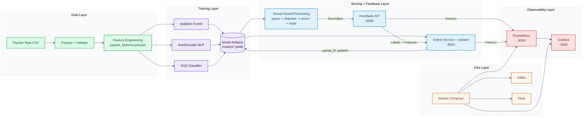
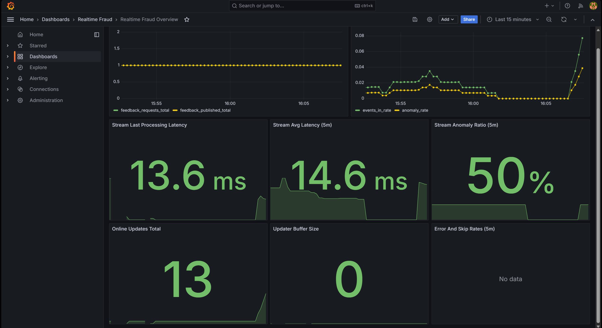
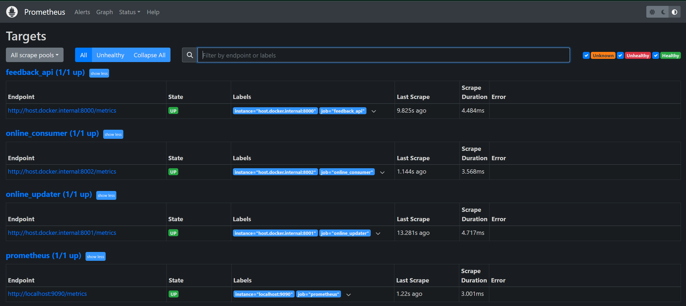
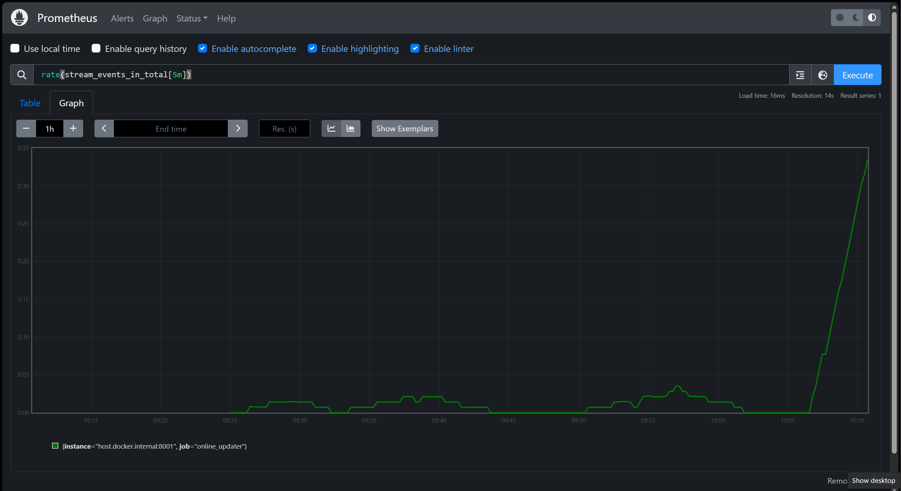

# Realtime Fraud Detection Pipeline

Real-time fraud detection workflow with offline model training, streaming inference, feedback-driven online updates, and observability via Prometheus/Grafana.

## What
This project provides an end-to-end fraud detection pipeline:
- Data preparation and feature engineering on PaySim.
- Baseline model training (Isolation Forest, AutoEncoder-style MLP, SGD classifier).
- Stream-style event scoring and anomaly routing.
- Analyst feedback ingestion.
- Online SGD model updates.
- Monitoring dashboards for pipeline and model-update activity.

## Why
- Detect suspicious transactions quickly.
- Close the loop between analyst feedback and model behavior.
- Track latency, anomaly flow, and update events with observable metrics.
- Provide a reproducible local setup for experimentation and extension.

## How
- Prepare PaySim data and build engineered features.
- Train baseline models and persist artifacts under `models/`.
- Run API and online service endpoints.
- Score events, route anomalies, collect feedback, and apply online updates.
- Scrape metrics with Prometheus and visualize in Grafana.

## Architecture


## Requirements
- Python 3.11+
- Conda (separate environment recommended)
- Docker Desktop (for Kafka/Flink/Prometheus/Grafana)

## Setup
```powershell
conda create -n <yourenv> python=3.11 -y
conda activate <yourenv>
pip install -r requirements.txt
```

## First-Time Workflow (End-to-End)
Run from repo root in `realtime-fraud` environment.

### 1. Start infrastructure
```powershell
docker compose -f infra/docker-compose.yml up -d
```

### 2. Download and prepare data
```powershell
python -m src.data.download_paysim --out data/raw
python -m src.data.prepare_paysim --input data/raw/PS_20174392719_1491204439457_log.csv --json
python -m src.data.feature_engineering --input data/raw/PS_20174392719_1491204439457_log.csv --output data/processed/paysim_features.parquet
```

### 3. Train baseline models
```powershell
python -m src.models.train_if --input data/processed/paysim_features.parquet
python -m src.models.train_ae --input data/processed/paysim_features.parquet
python -m src.models.train_sgd --input data/processed/paysim_features.parquet
```

Shortcut:
```powershell
scripts/tasks.ps1 -Task train-all
```

### 4. Start services
Open separate terminals for long-running services:
- API service:
```powershell
scripts/tasks.ps1 -Task start-api
```
- Online metrics service (`online_updater` Prometheus target):
```powershell
scripts/tasks.ps1 -Task start-online-service
```

### 5. Generate traffic and metrics
```powershell
scripts/tasks.ps1 -Task local-demo
scripts/tasks.ps1 -Task start-updater-sample
scripts/tasks.ps1 -Task seed-online-metrics
```

### 6. Verify observability
- Prometheus: `http://127.0.0.1:9090` -> `Status -> Targets`
  - `prometheus`: `UP`
  - `feedback_api`: `UP`
  - `online_updater`: `UP`
- Grafana: `http://127.0.0.1:3000` -> dashboard `Realtime Fraud Overview`

In Prometheus Graph, run:
- `feedback_requests_total`
- `feedback_published_total`
- `online_updates_total`
- `stream_events_in_total`
- `stream_events_anomaly_total`
- `stream_last_process_latency_ms`

### 7. Run benchmark/readiness reports
```powershell
scripts/tasks.ps1 -Task benchmark-report
scripts/tasks.ps1 -Task demo-readiness
scripts/tasks.ps1 -Task benchmark-report-trained
scripts/tasks.ps1 -Task demo-readiness-trained
```

## Common Run Commands

```powershell
# Run tests
scripts/tasks.ps1 -Task test

# Prepare features + train IF/AE/SGD in one command
scripts/tasks.ps1 -Task train-all

# Local demo flow
scripts/tasks.ps1 -Task local-demo

# Start feedback API
scripts/tasks.ps1 -Task start-api

# Start always-on online service metrics endpoint (for Prometheus online_updater target)
scripts/tasks.ps1 -Task start-online-service

# API healthcheck
scripts/tasks.ps1 -Task healthcheck-api

# Run online updater once
scripts/tasks.ps1 -Task start-updater

# Run updater with sample feedback
scripts/tasks.ps1 -Task start-updater-sample

# Benchmark report
scripts/tasks.ps1 -Task benchmark-report

# End-to-end readiness check
scripts/tasks.ps1 -Task demo-readiness

# Benchmark with trained model artifacts in models/
scripts/tasks.ps1 -Task benchmark-report-trained

# Readiness check with trained model artifacts in models/
scripts/tasks.ps1 -Task demo-readiness-trained

# Seed online service counters so Prometheus/Grafana panels show data quickly
scripts/tasks.ps1 -Task seed-online-metrics
```

## Outputs
- `reports/benchmark_report.json`
- `reports/demo_readiness_report.json`

## Endpoints
- API: `http://127.0.0.1:8000`
- API metrics: `http://127.0.0.1:8000/metrics`
- Prometheus: `http://127.0.0.1:9090`
- Grafana: `http://127.0.0.1:3000`

## Dashboard Snapshots
### Grafana Overview


### Prometheus Targets / Metrics



## Common Issues
- `NoBrokersAvailable`: start Kafka via Docker Compose.
- Missing model files in updater: generate baseline models first.
- Port conflict (`8000`, `8001`, `9090`, `3000`): stop the process using the port.
