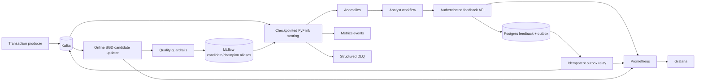
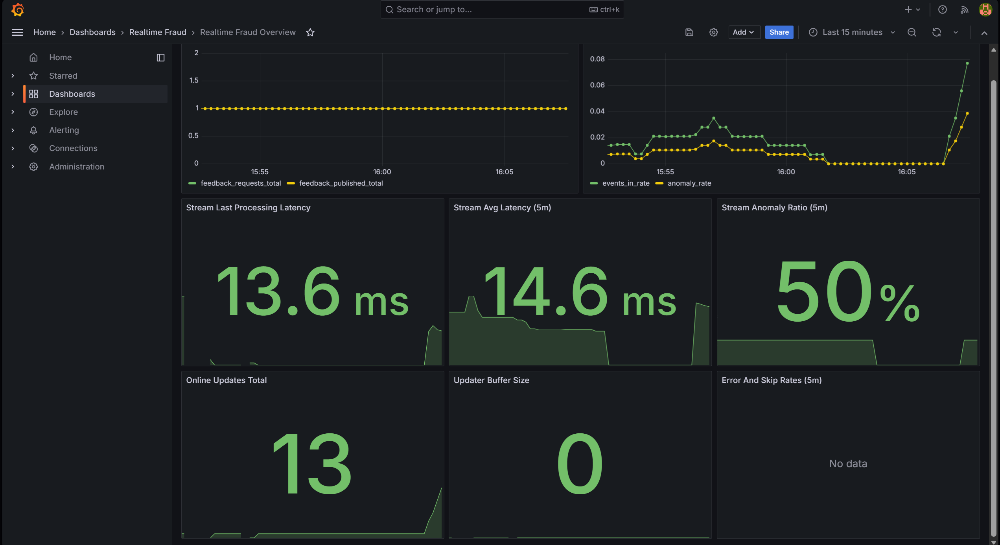

# Realtime Fraud Detection Pipeline

A production-reference implementation for event-time fraud scoring, durable analyst feedback, guarded online learning, immutable model promotion, and operational monitoring.

## Architecture


```mermaid
flowchart LR
  TX[Transaction producer] --> K[(Kafka)]
  K --> F[Checkpointed PyFlink scoring]
  F --> A[Anomalies]
  F --> M[Metrics events]
  F --> D[Structured DLQ]
  A --> UI[Analyst workflow]
  UI --> API[Authenticated feedback API]
  API --> P[(Postgres feedback + outbox)]
  P --> R[Idempotent outbox relay]
  R --> K
  K --> U[Online SGD candidate updater]
  U --> G[Quality guardrails]
  G --> ML[(MLflow candidate/champion aliases)]
  ML --> F
  API --> PR[Prometheus]
  R --> PR
  U --> PR
  PR --> GR[Grafana]
```

The repository supports three topologies:

- Development: locked Python 3.11 environment and isolated unit tests.
- Compose: containerized API, outbox relay, updater, Kafka, Postgres, MLflow, Flink, Prometheus, and Grafana.
- Demo deployment: the Compose stack on a single host behind a reverse proxy, with a synthetic traffic generator, for live evaluation. See [AWS demo deployment](docs/aws_demo_deployment.md).

See [architecture](docs/architecture.md) and [contracts and guarantees](docs/contracts_and_guarantees.md) for the detailed boundaries.

## Quick start

Install [uv](https://docs.astral.sh/uv/) and Docker Desktop, then run:

```powershell
uv sync --locked
uv run pytest
docker compose -f infra/docker-compose.yml config --quiet
.\scripts\smoke-compose.ps1
```

The smoke script does not overwrite an existing model. It creates a deterministic local seed only if needed, builds the stack, submits uniquely identified feedback, waits for outbox publication, and waits for online candidate promotion.

For real training, download PaySim and run the stages in order:

```powershell
uv run python -m src.data.download_paysim --out data/raw
uv run python -m src.data.prepare_paysim --input data/raw/<paysim>.csv --json
uv run python -m src.data.feature_engineering `
  --input data/raw/<paysim>.csv `
  --output data/processed/paysim_features.parquet
uv run python -m src.models.train_if --input data/processed/paysim_features.parquet
uv run python -m src.models.train_ae --input data/processed/paysim_features.parquet
uv run python -m src.models.train_sgd --input data/processed/paysim_features.parquet
uv run python -m src.models.build_ensemble `
  --input data/processed/paysim_features.parquet `
  --output models/fraud_ensemble.joblib `
  --model-version local-v1
```

## Quality gates

```powershell
uv run ruff check src tests scripts
uv run mypy src
uv run pytest
docker compose -f infra/docker-compose.yml config --quiet
```

The opt-in real infrastructure test is:

```powershell
$env:RUN_COMPOSE_INTEGRATION = '1'
uv run pytest tests/integration -m integration --no-cov
```

## Operations

- Feedback API: `http://localhost:8000`
- Online updater health and metrics: `http://localhost:8002/health`, `http://localhost:8002/metrics`
- Outbox relay health and metrics: `http://localhost:8003/health`, `http://localhost:8003/metrics`
- MLflow: `http://localhost:5000`
- Prometheus: `http://localhost:9090`
- Grafana: `http://localhost:3000`
- Flink: `http://localhost:8081`

### Monitoring dashboard



*Realtime fraud monitoring dashboard populated with synthetic local demo traffic.*

Runbooks:

- [Development and clean-machine verification](docs/development.md)
- [Compose operations](docs/compose_runbook.md)
- [Observability and alerts](docs/observability_runbook.md)
- [Local demo](docs/local_demo_runbook.md)
- [AWS demo deployment](docs/aws_demo_deployment.md)

## Project map

- `src/data`: validation, feature engineering, and chronological splits.
- `src/models`: training, calibration, immutable bundles, and MLflow lifecycle.
- `src/streaming`: contracts, scoring, and the checkpointed PyFlink job.
- `src/api`: authenticated feedback ingestion and transactional outbox.
- `src/online`: idempotent online updates, guardrails, and promotion.
- `src/demo`: local demo flow, readiness checks, and the synthetic traffic generator.
- `infra`: Compose, Dockerfiles, Prometheus, Grafana, and the demo reverse proxy.
- `scripts/deploy`: single-host deployment bootstrap, credential generation, and lifecycle.
- `tests`: unit, recovery/performance, and opt-in Compose integration tests.

Runtime datasets, model artifacts, reports, logs, secrets, and checkpoint state are intentionally not source-controlled.
